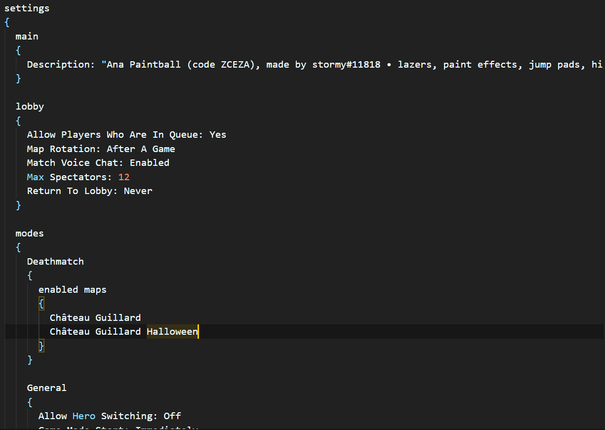
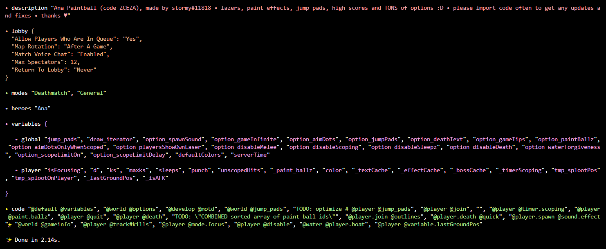

# workshop-deserializer
A parser-combinator for Overwatch Workshop Settings (Overwatch Workshop Config -> TypeScript)
(if you needed to convert data from an overwatch settings text file to javascript)

example code
```javascript
const { WorkshopDeserialize } = require('@workshopcodes/workshop-deserializer')

const fs = require('fs');
const path = require('path');

const txt = fs.readFileSync(__dirname + path.sep + 'ZCEZA', { encoding: 'utf-8' });

const workshopData = WorkshopDeserialize(txt);

console.dir(workshopData);
console.log(workshopData?.settings?.main?.description);
```

## input



## output

